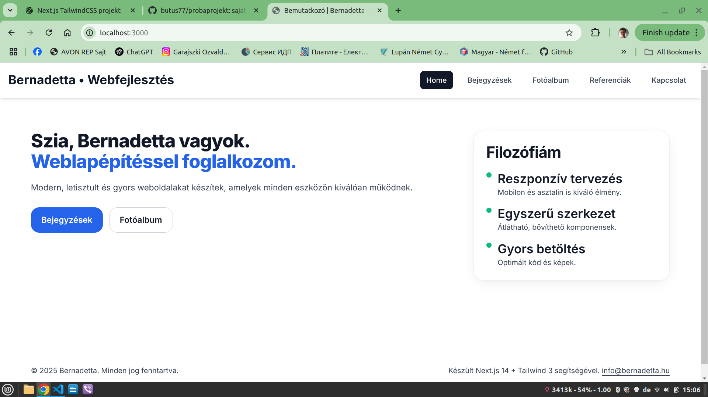
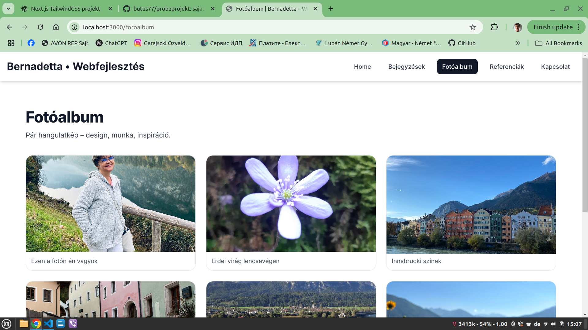

# Bernadetta – Próba Projekt

Ez egy **Next.js 14 + Tailwind CSS 3** alapú személyes weboldal, amit gyakorlati tanulás és kísérletezés céljából hoztam létre.  
Tartalmaz bemutatkozó oldalt, bejegyzéseket, fotóalbumot és kapcsolatfelvételi űrlapot.

[](https://probaprojekt.vercel.app)
[](https://probaprojekt.vercel.app)


## 🚀 Online elérhetőség
[**Megnyitás a Vercelen**](https://probaprojekt.vercel.app)

## 📦 Technológiák
- [Next.js 14](https://nextjs.org/) (App Router)
- [Tailwind CSS 3](https://tailwindcss.com/)
- TypeScript
- Lightbox fotógaléria

## 🔧 Fejlesztés lokálisan

1. Klónozd a repót:
   ```bash
   git clone https://github.com/butus77/probaprojekt.git
   cd probaprojekt
